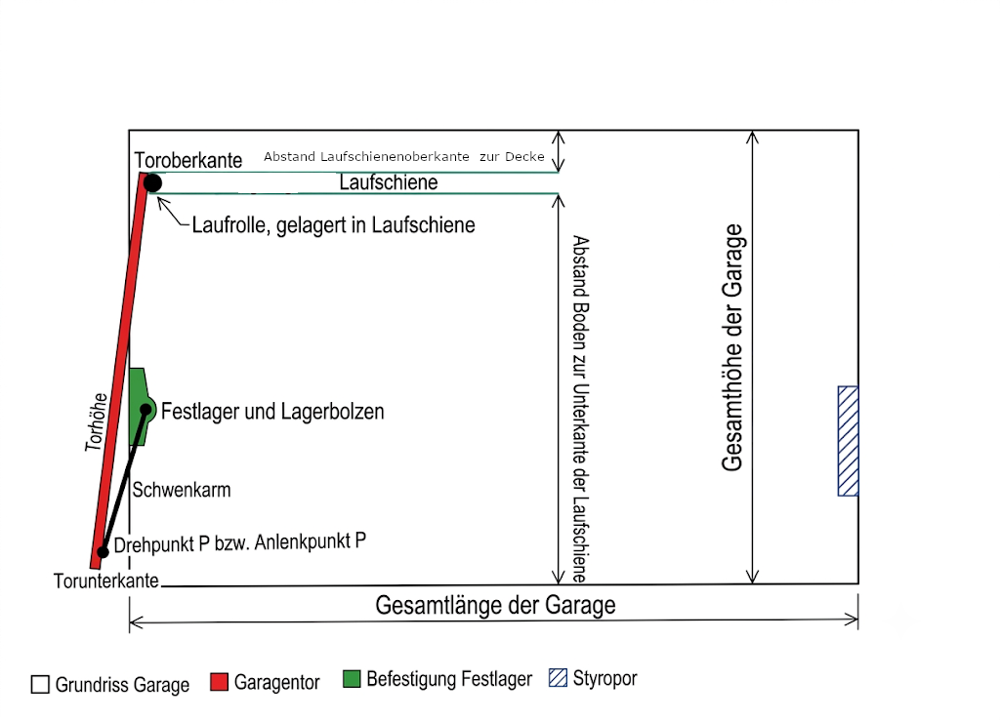

# Garagensimulator

Kinematische Simulation eines **vorstehenden Garagen-Schwingtors** mit
Übertotpunkt-Hebelmechanik und Prüfung, ob ein Fahrzeug trotz der
Schwenkbewegung des Tors sicher in die Bestandsgarage passt.

Aktueller Stand: **2D-Vertikalschnitt**. Langfristiges Ziel ist ein 3D-Modell
der Garage samt Einpark-Animation (siehe [Roadmap](docs/04-roadmap.md)).



## Schnellstart

Voraussetzung: Node.js 22 (siehe `.nvmrc`).

```bash
git clone https://github.com/F1rlefanz/Garagensimulator.git
cd Garagensimulator
npm ci        # exakt den Stand aus package-lock.json installieren
npm run dev   # Entwicklungsserver mit Hot Reload auf http://localhost:3000
```

`npm run dev` ist die eigentliche Live-Vorschau: Jede gespeicherte Änderung an
einem Messwert in `src/domain/garage.ts` schlägt ohne Neuladen in der Zeichnung
durch.

| Befehl | Wirkung |
| --- | --- |
| `npm run dev` | Entwicklungsserver mit Hot Reload |
| `npm run build` | Produktionsbuild nach `dist/` |
| `npm run preview` | Produktionsbuild lokal ausliefern |
| `npm run lint` | TypeScript-Typprüfung (`tsc --noEmit`) |
| `npm test` | Testlauf (Vitest) |
| `npm run check` | Typprüfung + Tests + Build |
| `npm run build:einzeldatei` | eigenständige HTML-Datei nach `dist-einzeldatei/` |

## Aufbau

```
src/
├── domain/                  Messwerte und Fahrzeugdaten — die einzige Quelle für Zahlen
│   ├── garage.ts               Garagen- und Tormaße, Konsistenzprüfung
│   └── fahrzeuge.ts            Fahrzeugkatalog
├── lib/                     Berechnung, rein funktional, ohne React
│   ├── kinematics.ts           Tor-Kinematik
│   ├── fahrzeuggeometrie.ts    Parkstellung, Kontur, Kollisionsprüfung
│   └── garagenpruefung.ts      passt das Fahrzeug hinein: Länge, Höhe, Breite
├── ui/                      Darstellung
│   ├── Riss.tsx                der Vertikalschnitt
│   ├── Eingaben.tsx            linke Spalte Garage, rechte Spalte Fahrzeug
│   ├── Befunde.tsx             Meldungen der Konsistenzprüfung
│   ├── Garagenbefund.tsx       Urteil je Achse: Länge, Höhe, Breite, Heckklappe
│   └── Seitenpanel.tsx         Statusleiste und eingeklapptes Befunde-Panel
├── fonts/                   eingebettete Schriften (OFL)
└── App.tsx                  Zusammensetzung

scripts/einzeldatei.mjs      Build zu einer eigenständigen HTML-Datei
docs/                        Handoff, Messwerte, offene Fragen, Roadmap,
                             Architektur, Marktrelevanz
```

Messwerte werden **ausschließlich** in `src/domain/` gepflegt. `DEFAULT_CONFIG`
in `src/lib/kinematics.ts` leitet sich vollständig daraus ab.

## Modell

Bezugssystem des 2D-Schnitts: Ursprung in der **Torschließebene** auf
Straßenniveau, `+x` in die Garage hinein, `+y` nach oben. Ein negatives `x`
liegt vor der Garage.

| Punkt | Bedeutung |
| --- | --- |
| `A` | Festlager des Schwenkarms an der Zarge (ortsfest) |
| `P` | Anlenkpunkt des Schwenkarms am Torblatt |
| `T` | Achse der Laufrolle in der Deckenlaufschiene |
| `O` / `B` | Ober- und Unterkante des Torblatts |
| `F` | Federpunkt am Schwenkarm, hinter `A` auf derselben Achse |

### Zwei Höhenbezüge

| Bezug | Lage | Worauf er sich bezieht |
| --- | --- | --- |
| Torschließebene | `y = 0` | Torblatt, Schwenkarm, Festlager |
| Garagenboden | `y = 0,124 m` | lichte Höhe, Garagenhöhe, Laufschiene, Fahrzeug |

Dazwischen liegen die Eisenschwelle und die dahinter ansteigende Rampe. Dieser
Versatz löst zwei Dinge auf, die lange wie Widersprüche aussahen: dass die
Laufrolle rechnerisch über ihrer Schiene lag, und dass Torblatt und Garage beide
mit 2,37 m gemessen wurden. Es sind zwei Spannen von zwei Nullpunkten — über der
Schließebene bleiben zwischen Toroberkante und Decke rund 15 cm Luft.

### Kennzahlen

Beim Öffnen fährt die Laufrolle `T` waagerecht in die Garage, während die
Unterkante `B` nach außen auf den Vorplatz schwenkt.

| Kennzahl | Wert |
| --- | --- |
| Größter Öffnungswinkel | **87,7°** — mechanischer Anschlag, wenn `P` senkrecht über `A` steht |
| Größter Überstand von `B` auf den Vorplatz | **1,148 m bei 59,4°**, auf 1,14 m Höhe |
| Überstand bei voller Öffnung | 0,085 m |
| Weg der Laufrolle nach innen | 2,238 m (Schiene ist 2,300 m lang) |
| Nutzbare Tiefe | 5,220 m (Rohbau 5,37 − 0,12 Federzone − 0,03 Dämmung) |
| Schmalste Stelle der Einfahrt | 2,240 m, bestimmt von den Schwenkarmen |

Der Überstand ist **nicht monoton**: Maßgeblich für den Freiraum vor der Garage
ist nicht die Endstellung, sondern der Durchgang bei rund 60°.

## Datenstand

Stand: Nachmessung vom 06.08.2026. **Kein harter Widerspruch mehr im Modell** —
`pruefeGeometrie()` meldet nur noch Warnungen im Bereich der Messunsicherheit.

Zwei unabhängige Gegenproben stützen das Ergebnis: Der maximale Weg der
Laufrolle (2,238 m) passt in die getrennt gemessene Schienenlänge (2,300 m), und
die Höhe der Rollenachse ergibt sich über Torblatt und Schwenkarm auf 2,5 cm
gleich.

> **Offen bleibt eine Messung:** Der Bodenversatz von 12,4 cm ist aus der
> Zwangsbedingung abgeleitet, nicht gemessen. Zulässig sind 9,3 bis 15,5 cm.
> Details und die übrigen Punkte: [`docs/03-offene-fragen.md`](docs/03-offene-fragen.md).

`pruefeGeometrie()` in `src/domain/garage.ts` meldet die Befunde zur Laufzeit.
`src/domain/garage.test.ts` hält den Stand fest: Wird ein Punkt durch Nachmessen
geklärt, schlägt der Test fehl und erinnert daran, Messwerte, Dokumentation und
Test gemeinsam nachzuziehen.

## Fahrzeuge

Die Auswahl in der Oberfläche bietet `Individuell` (frei editierbar) und einen
Katalog, dessen Maße gesperrt sind. Gepflegt wird er in
[`src/domain/fahrzeuge.ts`](src/domain/fahrzeuge.ts). Ursprung war die
Vergleichsmatrix „Autokauf"; am 06.08.2026 wurde der gesamte Katalog gegen
Herstellerdatenblätter geprüft, die Befunde stehen als OFFEN-12 bis OFFEN-41 in
[`docs/03-offene-fragen.md`](docs/03-offene-fragen.md).

**Der Beleg steht am einzelnen Maß, nicht am Fahrzeug.** Jedes Maß führt seine
**Quellenstufe** A bis D — von A (Herstellerdatenblatt, als Fakt zitierbar) bis
D (Forum, nur Hypothese) —, dazu Quelle und Abrufdatum. In der Oberfläche steht
die Stufe als Kürzel an der Zeile, der volle Beleg im Tooltip;
`schwaechsteQuellenstufe()` liefert die ehrliche Gesamtaussage über einen
Eintrag. Was nicht belegt ist, ist `undefined`: Es wurde nichts geschätzt, um
eine Lücke zu füllen. `pruefeGarage()` meldet eine solche Achse als *nicht
prüfbar*, statt sie stillschweigend zu bestehen.

**Die Höhe steht in zwei Feldern.** `hoehe` ist immer die Höhe *ohne*
Dachreling; wo die Reling serienmäßig ist, steht ihr Maß in
`hoeheMitDachreling`, und `pruefhoehe()` liefert den größeren der beiden. Vorher
stand teils der eine, teils der andere Wert in derselben Spalte — die Recherche
hat diese Verwechslung achtmal gefunden, und sie zeigt immer in dieselbe
Richtung: Das Tor sieht freier aus, als es ist.

Der **Marktstatus** sagt, ob ein Modell 2026 noch als Kaufoption zählt. Er hängt
an Abgasnorm- und Assistenzstichtagen, nicht am Alter — Herleitung in
[`docs/06-marktrelevanz.md`](docs/06-marktrelevanz.md).

Das **Seitenprofil** (Haubenlänge, Haubenhöhe, Scheiben- und Dachlänge) steht in
keinem Datenblatt und ist deshalb für kein Fahrzeug belegt. Ohne Profil rechnet
die Kollisionsprüfung mit einem **Quader über die volle Höhe** — die
konservative Richtung: Ein geschätztes Profil ließe das Tor freier aussehen, als
es ist.

Die Prüfung „passt es hinein" läuft über drei Achsen — nutzbare Tiefe (5,220 m),
lichte Höhe (2,170 m) und schmalste Stelle der Einfahrt (2,240 m). Ab 15 cm
Reserve gilt eine Achse als sicher, darunter als knapp; das schlechteste
Einzelurteil bestimmt das Gesamturteil. Das **engste bekannte Maß** ist nicht
die Fahrzeughöhe, sondern die Höhe bei geöffneter Heckklappe: Beim Caddy Maxi
bleiben rechnerisch 15 mm — innerhalb der Messunsicherheit, siehe
[OFFEN-10](docs/03-offene-fragen.md#offen-10).

## Veröffentlichung

Die Seite läuft unter **<https://f1rlefanz.github.io/Garagensimulator/>**.

`.github/workflows/pages.yml` baut den aktuellen Stand und veröffentlicht ihn —
aber erst, nachdem Typprüfung und Tests durchgelaufen
sind. Was nicht grün ist, geht nicht online.

Bauen und Veröffentlichen stecken bewusst in **einem** Workflow. Der Umweg über
einen `gh-pages`-Branch war der erste Anlauf und scheiterte daran, dass GitHub
dafür einen eigenen, nicht kontrollierbaren Workflow startet — der wartete
wiederholt eine Viertelstunde vergeblich auf einen Runner, während unsere
eigenen Läufe in unter einer Minute durch waren. Die Begründung steht in
[`docs/05-architektur.md`](docs/05-architektur.md).

**Es gibt genau eine Implementierung.** Entwicklungsserver, veröffentlichte
Seite und geteilte Vorschau sind dasselbe Programm, nur anders ausgeliefert;
`npm run build:einzeldatei` packt es in eine einzelne HTML-Datei. Eine
nachgebaute Vorschau hätte eine zweite Kinematik enthalten — und damit eine
zweite Wahrheit über die Maße.

## Dokumentation

| Dokument | Inhalt |
| --- | --- |
| [`docs/01-handoff.md`](docs/01-handoff.md) | Transkript des Handoff-Dokuments — die fachliche Quelle |
| [`docs/02-messwerte.md`](docs/02-messwerte.md) | Gepflegte Messwerte mit Herkunft und Vertrauensgrad |
| [`docs/03-offene-fragen.md`](docs/03-offene-fragen.md) | Widersprüche in den Messwerten, was nachzumessen ist |
| [`docs/04-roadmap.md`](docs/04-roadmap.md) | Weg von 2D nach 3D |
| [`docs/05-architektur.md`](docs/05-architektur.md) | Aufbau, Technologiewahl, Ablageort |
| [`docs/06-marktrelevanz.md`](docs/06-marktrelevanz.md) | Ab wann ein Modell veraltet ist — Stichtage statt Faustregeln |
| [`docs/bilder/`](docs/bilder/) | Schemaskizze und Fotos der Tormechanik |
